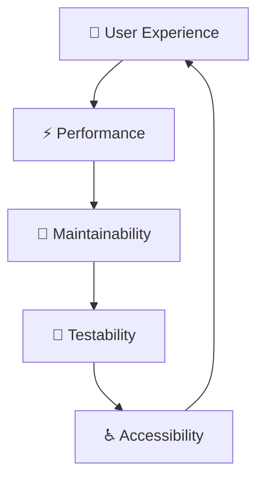

<div align="center">

# 📊 Ekstraksi Metadat## 📁 Struktur Proyek

<details>
<summary><strong>🔍 Klik untuk melihat struktur lengkap</strong></summary>

```
src/
├── components/           # Komponen React
│   ├── Layout.jsx       # Wrapper layout utama
│   ├── Header.jsx       # Header halaman
│   ├── GlowBlobs.jsx    # Efek background animasi
│   ├── InputForm.jsx    # Form input utama dengan tabs
│   ├── UrlForm.jsx      # Komponen input URL
│   ├── HtmlForm.jsx     # Komponen input HTML
│   ├── ErrorAlert.jsx   # Komponen tampilan error
│   ├── InfoAlert.jsx    # Komponen info notification
│   ├── WelcomeMessage.jsx # Komponen welcome/instruksi
│   ├── ResultsContainer.jsx # Wrapper hasil
│   ├── MetadataTable.jsx    # Tabel tampilan metadata
│   ├── AdditionalInfo.jsx   # Info metadata tambahan
│   ├── SintaCard.jsx        # Informasi jurnal Sinta
│   ├── ScimagoCard.jsx      # Informasi jurnal SCImago
│   ├── JournalPreview.jsx   # Preview website jurnal
│   ├── LoadingOverlay.jsx   # Overlay animasi loading
│   ├── SkeletonLoader.jsx   # Loading skeleton
│   ├── DragOverlay.jsx      # Overlay drag and drop
│   ├── IntroOverlay.jsx     # Animasi intro welcome
│   ├── TipsNotification.jsx # Tips dan notifikasi
│   ├── CopyButton.jsx       # Tombol copy to clipboard
│   └── index.js             # Ekspor komponen
├── hooks/                # Custom React hooks
│   ├── useJournalExtractor.js # Logika fetching data utama
│   ├── useDragAndDrop.js     # Fungsionalitas drag & drop
│   ├── usePasteHandler.js    # Handling paste global
│   ├── useCopyToClipboard.js # Copy to clipboard hook
│   └── index.js              # Ekspor hook
├── services/             # API dan layanan eksternal
│   └── api.js           # API calls dan fetching data
├── utils/               # Fungsi utilitas dan konstanta
│   ├── constants.js     # Konstanta aplikasi
│   ├── helpers.js       # Fungsi helper
│   ├── yearUtils.js     # Utilitas tahun publikasi
│   └── index.js        # Ekspor utilitas
├── styles/             # Styling
│   └── global.css      # Style global (Tailwind + Custom)
├── App.jsx             # Komponen aplikasi utama
└── main.jsx           # Entry point aplikasi React
```

</details>ikasi React Modern untuk Ekstraksi Metadata Artikel Jurnal

[](https://reactjs.org/)
[](https://vitejs.dev/)
[](https://tailwindcss.com/)
[](https://atiohaidar.github.io/extractor-metadata-of-research/)
[](https://eslint.org/)

<br>

</div>

## ✨ **Fitur Utama**

<table>
<tr>
<td width="50%">

### 🌐 **Ekstraksi Data**
- 🔗 **Ekstraksi berbasis URL** - Input URL jurnal langsung
- 📄 **Ekstraksi konten HTML** - Parse HTML content
- 🎯 **Integrasi Sinta** - Data jurnal Indonesia
- � **Integrasi SCImago** - Ranking jurnal internasional

</td>
<td width="50%">

### 🎨 **User Experience**
- 🖱️ **Drag & Drop** - Drop URL ke halaman
- ⌨️ **Global Paste** - Paste di mana saja (Ctrl+V)
- 📱 **Responsive Design** - Mobile friendly
- ⚡ **Loading Animations** - Feedback visual real-time

</td>
</tr>
</table>

---

*Aplikasi React modular untuk mengekstrak metadata dari artikel jurnal. Dikonversi dari HTML tunggal menjadi arsitektur React yang maintainable.*

## � Struktur Proyek

<p align="center">
  <a href="https://atiohaidar.github.io/extractor-metadata-of-research/">
    
  </a>
  <a href="#🚀-fitur">
    
  </a>
  <a href="#⚡-instalasi-cepat">
    
  </a>
</p>

---

</div>

## 🚀 Fitur

<table>
<tr>
<td width="50%">

### 🔗 Ekstraksi Data
- ✅ **Ekstraksi berbasis URL** - Input URL jurnal langsung
- ✅ **Ekstraksi konten HTML** - Parse metadata dari HTML
- ✅ **Integrasi Sinta** - Data jurnal dari database Sinta
- ✅ **Integrasi SCImago** - Informasi kuartil dan peringkat

</td>
<td width="50%">

### � Antarmuka Pengguna
- ✅ **Drag & Drop** - Drop URL ke halaman
- ✅ **Paste Global** - Paste URL/HTML di mana saja
- ✅ **Loading Animation** - Animasi loading yang indah
- ✅ **Responsive Design** - Bekerja di semua perangkat

</td>
</tr>
</table>

### 🚀 Performance
- **⚡ Loading Animations**: Feedback visual yang indah
-

</td>
</tr>
</table>

## 🏗️ Arsitektur Proyek

<details>
<summary><strong>� Klik untuk melihat struktur lengkap</strong></summary>

```
📁 src/
├── 🧩 components/              # Komponen React
│   ├── 🎯 Layout.jsx          # → Wrapper layout utama
│   ├── 📋 Header.jsx          # → Header halaman
│   ├── ✨ GlowBlobs.jsx       # → Efek background animasi
│   ├── 📝 InputForm.jsx       # → Form input utama dengan tabs
│   ├── 🔗 UrlForm.jsx         # → Komponen input URL
│   ├── 📄 HtmlForm.jsx        # → Komponen input HTML
│   ├── ❌ ErrorAlert.jsx      # → Komponen tampilan error
│   ├── 👋 WelcomeMessage.jsx  # → Komponen welcome/instruksi
│   ├── 📦 ResultsContainer.jsx # → Wrapper hasil
│   ├── 📊 MetadataTable.jsx   # → Tabel tampilan metadata
│   ├── ℹ️ AdditionalInfo.jsx   # → Info metadata tambahan
│   ├── 🇮🇩 SintaCard.jsx       # → Informasi jurnal Sinta
│   ├── 🌍 ScimagoCard.jsx     # → Informasi jurnal SCImago
│   ├── 👁️ JournalPreview.jsx   # → Preview website jurnal
│   ├── ⏳ LoadingOverlay.jsx   # → Overlay animasi loading
│   ├── 🖱️ DragOverlay.jsx      # → Overlay drag and drop
│   ├── 🎊 IntroOverlay.jsx     # → Animasi intro welcome
│   └── 📤 index.js            # → Ekspor komponen
├── 🎣 hooks/                   # Custom React hooks
│   ├── 🔄 useJournalExtractor.js # → Logika fetching data utama
│   ├── 🖱️ useDragAndDrop.js     # → Fungsionalitas drag & drop
│   ├── 📋 usePasteHandler.js    # → Handling paste global
│   └── 📤 index.js             # → Ekspor hook
├── 🌐 services/                # API dan layanan eksternal
│   └── 🔌 api.js              # → API calls dan fetching data
├── 🛠️ utils/                   # Fungsi utilitas dan konstanta
│   ├── 📋 constants.js        # → Konstanta aplikasi
│   ├── 🔧 helpers.js          # → Fungsi helper
│   └── 📤 index.js            # → Ekspor utilitas
├── 🎨 styles/                  # Styling
│   └── 🌍 global.css          # → Style global (Tailwind + Custom)
├── 🚀 App.jsx                  # Komponen aplikasi utama
└── ⚡ main.jsx                 # Entry point aplikasi React
```

</details>

## 🛠️ Stack Teknologi

<div align="center">

| Teknologi | Versi | Fungsi | Status |
|-----------|-------|--------|---------|
|  | `^18.3.1` | Frontend Framework | ✅ Stabil |
|  | `^5.3.4` | Build Tool & Dev Server | ⚡ Super Cepat |
|  | `^3.4.10` | CSS Framework | 🎨 Modern |
|  | `^8.57.0` | Code Quality | 🔍 Aktif |

</div>

## ⚡ Instalasi Cepat

<div align="center">

### 🚀 Langkah 1: Clone Repository
```bash
git clone https://github.com/atiohaidar/extractor-metadata-of-research.git
cd extractor-metadata-of-research
```

### � Langkah 2: Install Dependencies  
```bash
npm install
```

### 🔥 Langkah 3: Jalankan Development Server
```bash
npm run dev
```

### 🌐 Langkah 4: Buka Browser
Aplikasi akan tersedia di: **http://localhost:5173**

</div>

---

## 🎨 Filosofi Desain

> **"Simplicity is the ultimate sophistication"** - Leonardo da Vinci

<div align="center">

| 🏗️ **Modular** | 🔄 **Reusable** | 🚀 **Performant** | 🔧 **Maintainable** |
|:-------------:|:-------------:|:---------------:|:----------------:|
| Komponen terpisah | Custom hooks | Optimasi React | Code yang bersih |
| Tanggung jawab jelas | Logic terpusat | Lazy loading ready | Easy to maintain |

</div>

### 💡 Prinsip Pengembangan



- **🧩 Component Separation**: Setiap UI element adalah komponen independen
- **🎣 Custom Hooks**: Business logic terabstraksi dalam hooks reusable
- **📊 Clean State**: Manajemen state yang mudah dipahami dan debug
- **📖 Documentation**: JSDoc untuk developer experience yang optimal

## 🚀 Quick Start

<div align="center">

### 🌐 Coba Sekarang!
[](https://atiohaidar.github.io/extractor-metadata-of-research/)

**Atau install di komputer Anda:**

</div>

### 📋 Prasyarat
```bash
# Pastikan Node.js terinstall (v16+)
node --version  # ✅ Harus v16.0.0 atau lebih baru
npm --version   # ✅ Package manager
```

### ⚡ Instalasi Super Cepat

<details>
<summary><strong>🔧 Method 1: Clone Repository</strong></summary>

```bash
# 1️⃣ Clone project
git clone https://github.com/atiohaidar/extractor-metadata-of-research.git

# 2️⃣ Masuk ke direktori
cd extractor-metadata-of-research

# 3️⃣ Install dependencies
npm install

# 4️⃣ Jalankan development server
npm run dev
```

</details>

<details>
<summary><strong>📦 Method 2: Download ZIP</strong></summary>

1. **Download**: [📥 Download ZIP](https://github.com/atiohaidar/extractor-metadata-of-research/archive/refs/heads/master.zip)
2. **Extract** ke folder pilihan Anda
3. **Buka terminal** di folder tersebut
4. **Jalankan**:
   ```bash
   npm install && npm run dev
   ```

</details>

### 🎯 Commands Tersedia

| Command | Fungsi | Kapan Digunakan |
|---------|--------|-----------------|
| `npm run dev` | 🔥 **Development Server** | Coding & development lokal |
| `npm run build` | 📦 **Production Build** | Build untuk deploy |
| `npm run build:github` | 🚀 **GitHub Pages Build** | Deploy ke GitHub Pages |
| `npm run preview` | 👀 **Preview Build** | Test production build |
| `npm run lint` | 🔍 **Code Linting** | Check kualitas kode |

<div align="center">

### 🔥 Setelah `npm run dev`, buka:
**[http://localhost:5173](http://localhost:5173)** 🎉

</div>

---

## 📖 Panduan Penggunaan

### 🎯 Cara Menggunakan

<div align="center">

| 🔗 **Input URL** | 📄 **Input HTML** | �️ **Drag & Drop** |
|:---------------:|:---------------:|:-----------------:|
| Paste URL jurnal di tab URL | Copy-paste HTML jurnal | Drag URL langsung ke halaman |
| Klik tombol "Extract Metadata" | Klik "Extract dari HTML" | Otomatis terdeteksi |

</div>

### 💡 Tips & Tricks

<details>
<summary><strong>🚀 Fitur Tersembunyi</strong></summary>

- **Global Paste**: Tekan `Ctrl+V` di mana saja untuk paste URL/HTML
- **Drag Multiple URLs**: Drag beberapa URL sekaligus (dipisah baris baru)  
- **Copy Results**: Gunakan tombol copy di setiap hasil untuk clipboard
- **Mobile Support**: Bekerja sempurna di smartphone & tablet

</details>

## 🔌 Integrasi API

<div align="center">

| API | Fungsi | Status |
|-----|--------|--------|
| 🌐 **Ekstraksi Utama** | [`api-ekstrak-web-jurnal.atiohaidar.workers.dev`](https://api-ekstrak-web-jurnal.atiohaidar.workers.dev) | ✅ Aktif |
| 🇮🇩 **Sinta Database** | [`sinta-journal-api-production.atiohaidar.workers.dev`](https://sinta-journal-api-production.atiohaidar.workers.dev) | ✅ Aktif |
| 🌍 **SCImago API** | [`scrape.scimago.workers.dev`](https://scrape.scimago.workers.dev) | ✅ Aktif |

</div>

---

## 🤝 Berkontribusi

<div align="center">

[](https://github.com/atiohaidar/extractor-metadata-of-research/pulls)
[](https://github.com/atiohaidar/extractor-metadata-of-research/issues)

</div>

### 🚀 Cara Berkontribusi

1. **🍴 Fork** repository ini
2. **🌿 Buat branch** fitur baru (`git checkout -b feature/amazing-feature`)
3. **💻 Commit** perubahan (`git commit -m 'Add: amazing feature'`)
4. **📤 Push** ke branch (`git push origin feature/amazing-feature`)
5. **🔄 Buat Pull Request**

### � Panduan Kontribusi

<details>
<summary><strong>📖 Baca Panduan Lengkap</strong></summary>

- 📚 **Maintenance Guide**: [MAINTANCE.md](MAINTANCE.md)
- 🏗️ **Architecture Guide**: Lihat struktur folder di atas
- 📝 **Code Style**: Ikuti ESLint configuration yang ada

</details>

---

## 📄 Lisensi & Credits

<div align="center">

**� Proyek ini mempertahankan fungsionalitas aplikasi HTML asli**  
**🔄 Sambil menyediakan arsitektur React modern & maintainable**

---

### 🤖 Built with ❤️ using:
**GitHub Copilot** - AI Pair Programming

<a href="https://github.com/atiohaidar/extractor-metadata-of-research/stargazers">
  
</a>
<a href="https://github.com/atiohaidar/extractor-metadata-of-research/network/members">
  
</a>

</div>

<details>
<summary><strong>🖱️ Drag & Drop Magic</strong></summary>

- **Drag URL** dari address bar browser langsung ke aplikasi
- **Drop file HTML** untuk ekstraksi offline
- **Visual feedback** saat drag over area

</details>

<details>
<summary><strong>⌨️ Keyboard Shortcuts</strong></summary>

- `Ctrl + V` (Windows) / `Cmd + V` (Mac): Paste URL/HTML di mana saja
- `Tab`: Navigasi antar input
- `Enter`: Submit form aktif

</details>

<details>
<summary><strong>📱 Mobile Experience</strong></summary>

- **Touch-friendly**: Interface dioptimasi untuk sentuhan
- **Responsive**: Layout adaptif untuk semua ukuran layar
- **Fast loading**: Optimasi khusus untuk koneksi mobile

</details>

## 🔌 Integrasi API

Aplikasi terintegrasi dengan beberapa API eksternal:
- **API ekstraksi utama**: `https://api-ekstrak-web-jurnal.atiohaidar.workers.dev`
- **API Sinta**: `https://sinta-journal-api-production.atiohaidar.workers.dev`
- **API SCImago**: `https://scrape.scimago.workers.dev`

## 🎯 Komponen Utama

### Hook `useJournalExtractor`
Mengelola logika ekstraksi data utama dengan loading states dan error handling.

### Hook `useDragAndDrop`
Menangani fungsionalitas drag and drop dengan feedback visual.

### Hook `usePasteHandler`
Menyediakan fungsionalitas paste global untuk UX yang lebih baik.

### Arsitektur Komponen
Setiap komponen berdiri sendiri dengan interface props yang jelas dan tanggung jawab yang terdefinisi.

## 🔄 Manajemen State

Aplikasi menggunakan manajemen state bawaan React:
- **useState**: Untuk state level komponen
- **useEffect**: Untuk side effects dan lifecycle management
- **useCallback**: Untuk optimasi performa
- **Custom hooks**: Untuk logika dan state yang dibagikan

## 🎨 Styling

Style diorganisir dalam file CSS global tunggal (`src/styles/global.css`) yang mempertahankan desain asli sambil dioptimalkan untuk React:
- CSS custom properties untuk theming yang konsisten
- Desain responsif dengan kelas Tailwind
- Animasi dan transisi custom
- Dukungan tema dark/light

## 🚀 Optimasi Performa

- **Pemisahan komponen**: Struktur siap untuk lazy loading
- **Memoization**: useCallback untuk operasi yang mahal
- **Re-render yang efisien**: Array dependency yang tepat
- **Optimasi bundle**: Code splitting otomatis Vite

## 🤝 **Contributing**

<div align="center">

[](MAINTANCE.md)
[](https://github.com/atiohaidar/extractor-metadata-of-research/fork)
[](https://github.com/atiohaidar/extractor-metadata-of-research/issues/new)

</div>

### **📋 Development Workflow**

1. **🍴 Fork** repository ini
2. **🌟 Create** feature branch (`git checkout -b feature/AmazingFeature`)
3. **💾 Commit** perubahan (`git commit -m 'Add some AmazingFeature'`)
4. **📤 Push** ke branch (`git push origin feature/AmazingFeature`)
5. **🔄 Open** Pull Request

### **✅ Development Checklist**
- [ ] Ikuti struktur komponen yang ada
- [ ] Tambahkan JSDoc untuk functions
- [ ] Test di mobile & desktop
- [ ] Pastikan tidak ada ESLint errors
- [ ] Update dokumentasi jika perlu

---

<div align="center">

## 📄 **Lisensi & Credits**

**🤖 Powered by GitHub Copilot** | **⚡ Built with Love & React**

*Project ini mempertahankan fungsionalitas aplikasi HTML asli sambil menyediakan arsitektur React modern yang maintainable.*

<br>

[](https://github.com/atiohaidar/extractor-metadata-of-research)
[](https://atiohaidar.github.io/extractor-metadata-of-research/)
[](MAINTANCE.md)

---

<sub>⭐ **Jika project ini membantu, berikan star!** ⭐</sub>

</div>
